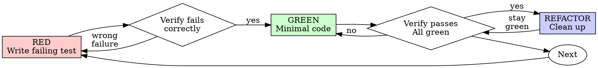

# Test-Driven Development (TDD)

## Overview

Write the test first. Watch it fail. Write minimal code to pass.

**Core principle:** If you didn't watch the test fail, you don't know if it tests the right thing.

**Violating the letter of the rules is violating the spirit of the rules.**

## When to Use

**Always:**
- New features
- Bug fixes
- Refactoring
- Behavior changes

**Exceptions (ask your human partner):**
- Throwaway prototypes
- Generated code
- Configuration files

Thinking "skip TDD just this once"? Stop. That's rationalization.

## The Iron Law

```
NO PRODUCTION CODE WITHOUT A FAILING TEST FIRST
```

Write code before the test? Delete it. Start over.

**No exceptions:**
- Don't keep it as "reference"
- Don't "adapt" it while writing tests
- Don't look at it
- Delete means delete

Implement fresh from tests. Period.

## Red-Green-Refactor



### RED - Write Failing Test

Write one minimal test showing what should happen.

<Good>
```python
def test_slug_from_title_basic():
    assert slug_from_title("Hello, World!") == "hello-world"
```
Clear name, tests real behavior, one thing.
</Good>

<Bad>
```python
def test_slug(mocker):
    mock_slugger = mocker.Mock()
    mock_slugger.slug.return_value = "hello-world"
    result = mock_slugger.slug("Hello, World!")
    mock_slugger.slug.assert_called_once()
```
Vague name, tests mock not code.
</Bad>

**Requirements:**
- One behavior per test
- Clear name describing expected behavior: `test_<unit>_<scenario>_<expected>`
- Real code (no mocks unless unavoidable — e.g., external HTTP calls)

### Verify RED - Watch It Fail

**MANDATORY. Never skip.**

```bash
uv run pytest tests/recipes/test_models.py::test_slug_from_title_basic -v
```

Confirm:
- Test fails (not import errors)
- Failure message is what you expect
- Fails because the feature is missing, not due to typos

**Test passes?** You're testing existing behavior. Fix the test.

**Test errors/won't import?** Fix the error, re-run until it fails correctly.

### GREEN - Minimal Code

Write the simplest code that makes the test pass.

<Good>
```python
def slug_from_title(title: str) -> str:
    return title.lower().replace(", ", "-").replace("!", "")
```
Just enough to pass.
</Good>

<Bad>
```python
def slug_from_title(title: str, *, max_length: int = 50, separator: str = "-") -> str:
    # normalize unicode, handle RTL, truncate, strip special chars...
```
Over-engineered before there are tests for those cases.
</Bad>

Don't add features, refactor other code, or "improve" beyond what the failing test needs.

### Verify GREEN - Watch It Pass

**MANDATORY.**

```bash
uv run pytest tests/ -v
```

Confirm:
- The target test passes
- All other tests still pass
- Output is pristine (no errors, warnings)

**Test fails?** Fix the code, not the test.

**Other tests fail?** Fix them now.

### REFACTOR - Clean Up

After green only:
- Remove duplication
- Improve names
- Extract helpers

Keep tests green throughout. Don't add new behavior.

### Repeat

Next failing test for the next behavior.

## Good Tests

| Quality | Good | Bad |
|---------|------|-----|
| **Minimal** | One behavior. "and" in name? Split it. | `test_parse_article_and_strip_markdown_and_capitalize` |
| **Clear** | Name describes expected behavior | `test_foo`, `test_1` |
| **Real** | Tests production code paths | Tests mock return values |

## Why Order Matters

**"I'll write tests after to verify it works"**

Tests written after code pass immediately. Passing immediately proves nothing:
- Might test the wrong thing
- Might test implementation, not behavior
- Might miss edge cases you forgot
- You never saw it catch the bug

Test-first forces you to see the test fail, proving it actually tests something.

**"Deleting X hours of work is wasteful"**

Sunk cost fallacy. The time is already gone:
- Delete and rewrite with TDD (X more hours, high confidence)
- Keep it and add tests after (30 min, low confidence, likely bugs)

The "waste" is keeping code you can't trust.

## Common Rationalizations

| Excuse | Reality |
|--------|---------|
| "Too simple to test" | Simple code breaks. Test takes 30 seconds. |
| "I'll test after" | Tests passing immediately prove nothing. |
| "Already manually tested" | Ad-hoc ≠ systematic. No record, can't re-run. |
| "Deleting X hours is wasteful" | Sunk cost fallacy. Keeping unverified code is technical debt. |
| "Need to explore first" | Fine. Throw away the exploration, start with TDD. |
| "Test is hard to write" | Listen to it. Hard to test = hard to use. Simplify the design. |
| "TDD will slow me down" | TDD is faster than debugging. Pragmatic = test-first. |
| "Existing code has no tests" | You're improving it. Add tests for what you touch. |

## Red Flags — STOP and Start Over

- Code written before the test
- Test added after implementation
- Test passes immediately without any implementation
- Can't explain why the test failed
- "I'll add tests later"
- Rationalizing "just this once"

**All of these mean: delete the code, start over with TDD.**

## Example: Bug Fix

**Bug:** Empty title produces non-empty slug.

**RED**
```python
def test_slug_from_title_empty_input():
    assert slug_from_title("") == ""
```

**Verify RED**
```bash
$ uv run pytest tests/recipes/test_utils.py::test_slug_from_title_empty_input -v
FAILED tests/recipes/test_utils.py::test_slug_from_title_empty_input
AssertionError: assert "-" == ""
```

**GREEN**
```python
def slug_from_title(title: str) -> str:
    title = title.strip()
    if not title:
        return ""
    # existing logic...
```

**Verify GREEN**
```bash
$ uv run pytest tests/ -v
PASSED tests/recipes/test_utils.py::test_slug_from_title_empty_input
```

**REFACTOR** — extract strip to a shared helper if needed.

## Verification Checklist

Before marking work complete:

- [ ] Every new function/method has a test
- [ ] Watched each test fail before implementing
- [ ] Each test failed for the expected reason (feature missing, not import error)
- [ ] Wrote minimal code to pass each test
- [ ] All tests pass: `uv run pytest tests/ -v`
- [ ] Full QA passes: `task qa`

Can't check all boxes? You skipped TDD. Start over.

## When Stuck

| Problem | Solution |
|---------|----------|
| Don't know how to test | Write the wished-for function call first. Write the assertion. Ask your human partner. |
| Test too complicated | Design too complicated. Simplify the interface. |
| Must mock everything | Code too coupled. Use dependency injection or extract an interface. |
| Test setup is huge | Extract fixtures to `conftest.py`. Still complex? Simplify the design. |

## Final Rule

```
Production code → a test exists that failed before this code was written
Otherwise → not TDD
```

No exceptions without your human partner's permission.
